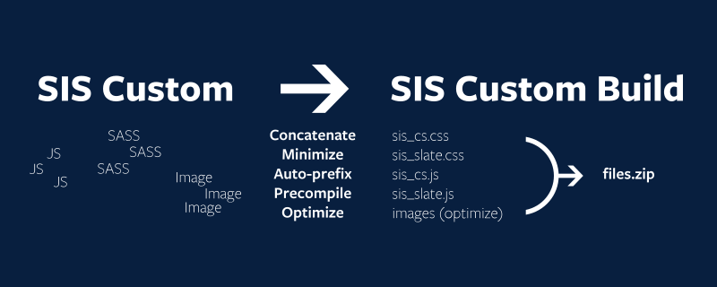

### PeopleSoft Fluid UI Development

Developing pages in [PeopleSoft Fluid UI](http://docs.oracle.com/cd/E55243_01/pt854pbr0/eng/pt/tgst/concept_PeopleSoftFluidUserInterface.html#topofpage) can be pretty time consuming and cumbersome.

In this post we'll explain 2 ways to make your workflow better & faster:

1. **Tampermonkey**: loading local CSS & JavaScript on your Fluid UI page.
2. **SIS Custom**: framework to concatenate, minify, autoprefix and precompile your assets.

### 1. [Tampermonkey][Tampermonkey]

Most of the times you probably prefer to not use PeopleSoft App Designer when modifying files. This will allow you to use your favorite editor and have a faster save-reload cycle.

The main plug-in we'll be using is called [Tampermonkey][Tampermonkey] (Google Chrome) which allows you to load *custom CSS & JavaScript* on any page. If you're using FireFox, check out [Greasemonkey][Greasemonkey].

#### Installation

1. [Install Tampermonkey][TampermonkeyInstall]
2. [Allow for local files](http://cl.ly/aXZc) on the `chrome://extensions` page.

#### Create Script

1. Click on the Tampermonkey icon and select [Add a new script](http://cl.ly/aXt2)
1. Add the following code:

```js
// ==UserScript==
// @name         Fluid UI Custom
// @namespace    christianvuerings
// @version      0.1
// @description  Load local JavaScript and CSS
// @author       Christian Vuerings
// @match        *://*/*
// @require      file:///Users/christian/Projects/sis-custom/dist/sis_cs.js
// @resource     sis_cs file:///Users/christian/Projects/sis-custom/dist/sis_cs.css
// @grant        GM_addStyle
// @grant        GM_getResourceText
// ==/UserScript==

var sis_cs = GM_getResourceText("sis_cs");
GM_addStyle(sis_cs);
```

You'll need to update the location of your local JavaScript and CSS scripts in the `@resource` and `@require` attributes. You can also update the `@match` attribute if you want to only load these files on certain pages, have a look at the [@match patterns](https://developer.chrome.com/extensions/match_patterns) site if you do.

#### Add CSS / JavaScript to PeopleSoft

As soon as you're finished with your local custom CSS & JS, you should move it to the actual PeopleSoft code. Feel free to check out [some recommended steps](https://github.com/ucberkeley/sis-custom/blob/master/docs/update_sis.md).

### 2. [SIS Custom][siscustom]

Loading custom JS & CSS locally is just the first step in improving your workflow. Usually you'll also want to make sure you don't have to save code in 1 file and you'll want some other optimization steps like:

* Concatenation
* Minification
* Autoprefixing (Browser prefixes)
* Precompilation (SASS)
* Opimization (Images)

Have a look at the [installation instructions](https://github.com/ucberkeley/sis-custom/blob/master/docs/installation.md) and [our other docs](https://github.com/ucberkeley/sis-custom/blob/master/README.md).

#### [SIS Custom Build][siscustombuild]

[](./2015-04-06-sis-custom-infographic.svg)

In order to make the lifes easier for non front-end devs, we also developed a [heroku](https://www.heroku.com/) app called [SIS Custom Build][siscustombuild].

This tool will automatically run the [SIS Custom][siscustom] build as soon as we push our changes to GitHub. We're using [GitHub Webhooks](https://help.github.com/articles/about-webhooks/) which will trigger the build.

When the build is complete it makes all the assets available in the following format:

* [List of files](https://sis-custom-build.herokuapp.com/dist)
* [Zip file](https://sis-custom-build.herokuapp.com/dist/files_latest.zip)

That way to other devs can easily see & download the latest version of the files.

### Next steps

These are a couple of things we're currently dreaming of:

1. Find a way to use [LiveReload][livereload] or [BrowserSync][browsersync] with [Tampermonkey][Tampermonkey]. That way we wouldn't have to manually reload the browser every time.
1. Automatically add the CSS / JavaScript and images to PeopleSoft when pushing to GitHub.

### Conclusion

We should always use the best tool for the job and being productive as a developer should be an important focus.

I hope you'll be able to use this in your daily development workflow and if you have any remarks / comments, feel free to [contact me on twitter](https://twitter.com/christianvuer).

[browsersync]: http://www.browsersync.io/
[Greasemonkey]: https://addons.mozilla.org/en-Us/firefox/addon/greasemonkey/
[livereload]: http://livereload.com/
[siscustom]: https://github.com/ucberkeley/sis-custom
[siscustombuild]: https://github.com/ucberkeley/sis-custom-build
[Tampermonkey]: http://tampermonkey.net/
[TampermonkeyInstall]: https://chrome.google.com/webstore/detail/tampermonkey/dhdgffkkebhmkfjojejmpbldmpobfkfo?hl=en
